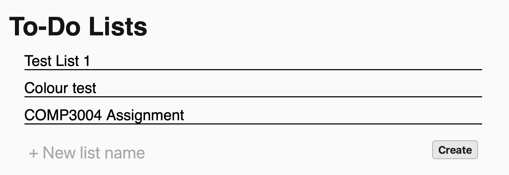
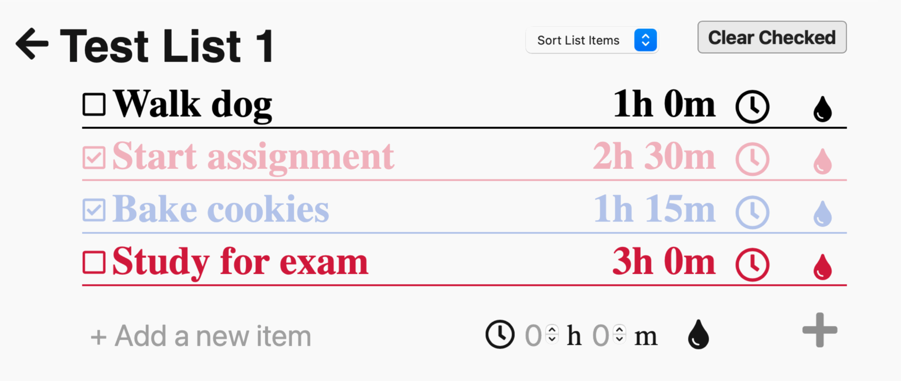

# ToDoList
A Simple to-do list app made with Express and Socket.io.
---
  
## Features
- Create and edit collaborative lists
- Multiple people can edit a list at once with changes applied in real time
- Set item colour and duration
- Local sorting by creation, duration, name, or hue
---
  
## Preview


---
  
## Setup
Install and run locally with npm:
```sh
$ npm install
$ npm start
```